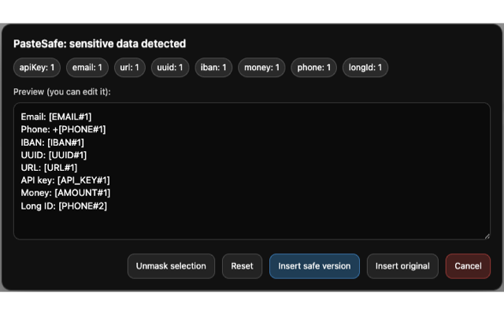

<h1 align="center">PasteSafe — AI Paste Protection</h1>

Prevent accidentally leaking secrets into AI chats.

---

## 🚀 What is PasteSafe?

PasteSafe protects you from **accidentally leaking sensitive data when using AI tools**.

When you paste text into AI chats like **ChatGPT, Gemini, or Claude**, the extension scans the content locally and detects sensitive information before it gets sent.

If something risky is found, PasteSafe can **warn you or automatically mask it**.

---

## 📦 Install

Chrome Web Store:

[https://chromewebstore.google.com/detail/pastesafe---ai-paste-sani/gpoiombmmaegnifjmcelgbkfbkelgdih](https://chromewebstore.google.com/detail/pastesafe-%E2%80%94-ai-paste-sani/gpoiombmmaegnfijmcelgbkfbkelgdih)

Project page:

pastsafe-ext.github.io/pastesafe/

---

## 🖥 Screenshot

---

## ✨ Features

🔐 **100% Local Processing**  
No text is sent to external servers.

⚡ **Real-Time Paste Protection**  
Sensitive data is detected immediately when pasting.

🤖 **AI Chat Integration**  
Works directly inside:

- ChatGPT  
- Gemini  
- Claude  

🧠 **Pattern-Based Detection**  
Detects common sensitive data patterns automatically.

🎭 **Automatic Masking**  
Replace sensitive values with placeholders before sending.

🔍 **Paste Interception**  
Analyzes text before it is inserted into the chat input.

💡 **Developer-Friendly**  
Designed for developers who frequently paste logs and configs.

---

## 🧬 Detection Patterns

PasteSafe currently detects:

📧 Emails  
🔑 API Keys  
📱 Phone numbers  
🆔 UUIDs / IDs  
🌐 URLs  
💰 Monetary values  
🏦 IBAN numbers  
🔢 Long identifiers

More patterns are planned.

---

## 🧪 Example

Before:
API key: sk-1234567890abcdef
Email: user@company.com

After:
API key: [API_KEY#1]
Email: [EMAIL#1]

---

## ⚙️ How it works

1. User pastes text into an AI chat
2. PasteSafe intercepts the paste event
3. The text is scanned locally for sensitive patterns
4. If sensitive data is found:

   - warn user  
   - or automatically mask the values

5. The sanitized text is inserted into the chat

---

## 🔒 Privacy First

PasteSafe is designed with privacy in mind.

✔ All processing happens locally in the browser  
✔ No pasted content leaves your machine  
✔ No analytics or tracking  
✔ No external APIs

---

## 🎯 Why this exists

Developers often paste:

- logs
- configs
- stack traces
- environment variables

into AI chats while debugging.

When moving fast, it's **very easy to accidentally leak secrets**.

PasteSafe adds a simple safety layer.

---

## 🛣 Roadmap

Planned improvements:

- More detection patterns
- Custom rule configuration
- Support for additional AI tools
- Enterprise security rules

---

## 💬 Feedback

If you try PasteSafe and have suggestions or ideas, feel free to open an issue.
